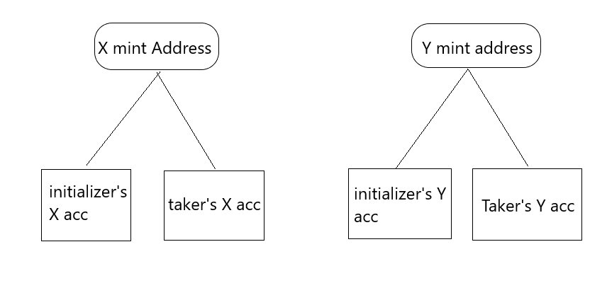

# Introduction
This is implementation of Escrow Program. Original Tutorial is in [paulx.dev](https://paulx.dev/blog/2021/01/14/programming-on-solana-an-introduction/)

### Tokens and Accounts needed for test
1- 2 throw away private keys
2- 4 token mint address ( create yourself by `spl-token create-token`)
3- 4 token accounts from mint addresses provided. 2 for initializer, 2 for taker. Both initailizer and taker should provide 1 token account for each mint address.



### UI for testing it
I'm a lazy cat. I didn't write any UI code for testing it. You can use The same UI I used in [Paulx.dev](https://paulx.dev/blog/2021/01/14/programming-on-solana-an-introduction/)

### Environment Setup
1. Install Rust from https://rustup.rs/
2. Install Solana from https://docs.solana.com/cli/install-solana-cli-tools#use-solanas-install-tool

### Build and test for program compiled natively
```
$ cargo build
$ cargo test
```

### Build and test the program compiled for BPF
```
$ cargo build-bpf
$ cargo test-bpf
```
